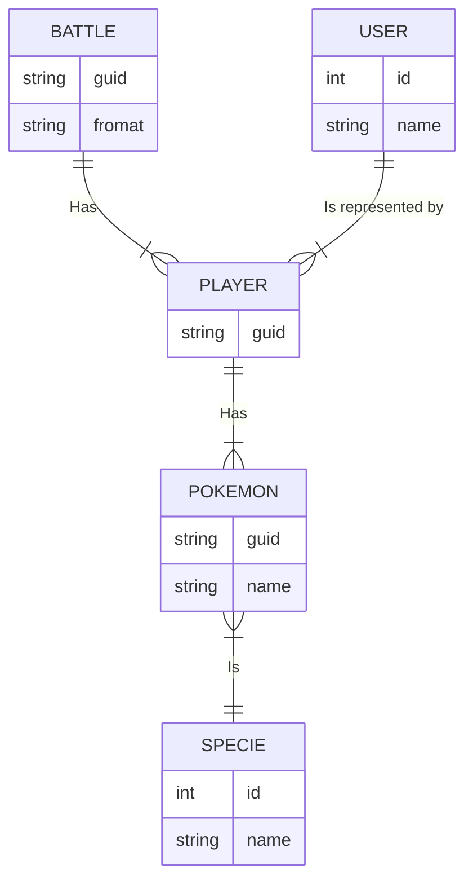

# ER Diagram

An er diagram is used in order to represents the entities and the relations between them.

```mermaid
erDiagram
    %% (1, 2)
    BATTLE ||--|{ PLAYER : Has

    %% (1, n)
    USER ||--|{ PLAYER : "Is represented by"

    %% (1, 1-6)
    PLAYER ||--|{ POKEMON : Has
    POKEMON }|--|| SPECIE : Is

    PLAYER {
        string guid
    }

    USER {
        int id
        string name
    }

    BATTLE {
        string guid
        string fromat
    }

    POKEMON {
        string guid
        string name
    }

    SPECIE {
        int id
        string name
    }
```
